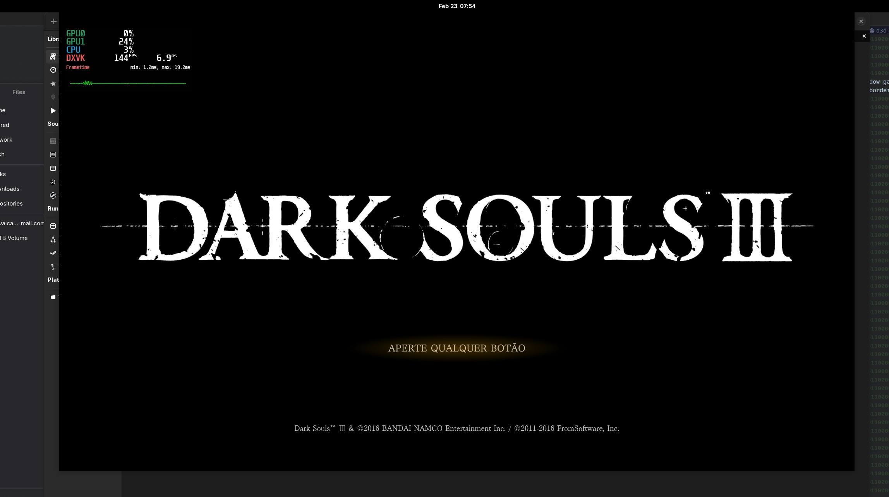

# MOD Souls 3

Features:

- change fps cap
- centralize the window game
- remove the window border

This mod was tested on Linux (Archlinux) with **wine-11.0**



## How to install:

1. Move the **d3dcompiler_43.dll** to Game directory (the same dir as **DarkSoulsIII.exe**)
1. create the [mod_ds3.ini](./docs/mod_ds3.ini)

## Development on linux

Add gnu-windows as target:

```bash
rustup target install x86_64-pc-windows-gnu
```

Install **wine**, on archlinux:

```
sudo pacman -S wine
```

## Dev Windows

Please see the [config.toml](./.cargo/config.toml) and remove the runner
